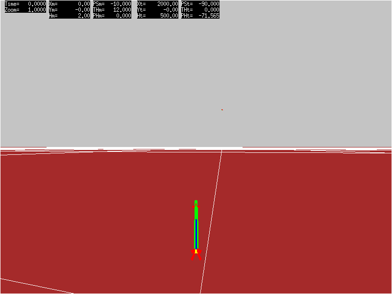
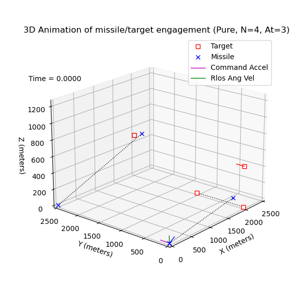
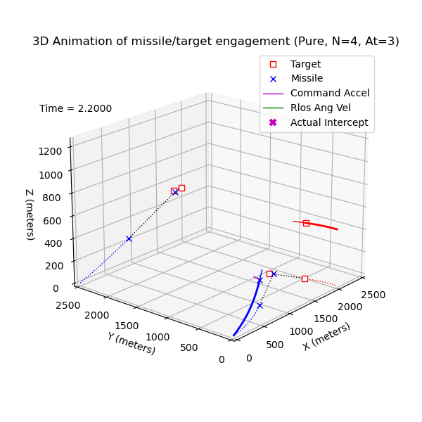
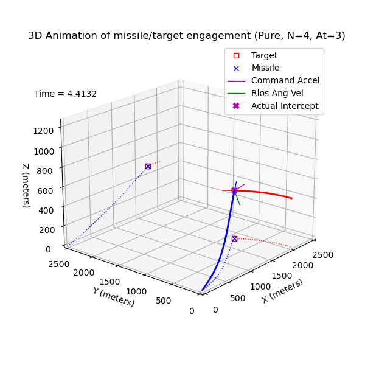

# propNav #

____________

 

    
  Animated GIF from threeD rendering for TXYZ.OUT.1243.
 

A 3-DOF point mass kinematic model of an ideal proportional navigation guidance missile written entirely in Python 3; dependent upon only two readily available modules - NumPy and Matplotlib.

## Overview ##

The **propNav** program was refactored from a Mathcad variant developed in the mid to late 1990's as a tool to perform rudimentary evaluations of surface to air missile (SAM) engagement capabilities against likely targets. During that time, a high fidelity 6-DOF missile simulation was utilized to perform detailed engineering analysis of candidate SAM performance in specific target engagement scenarios. However, when evaluating performance envelopes for multiple engagement scenarios requiring hundreds of run cases, a 3-DOF was easier to setup, and used much less computing resources and time than the 6-DOF. Of course, there was a known and acceptable loss of accuracy when employing a 3-DOF in this manner.

Also included in this repository are the components of **pyThreeD**, a Python 3 variant of the X11/C **[threeD](https://github.com/gedeschaines/threeD)** program. As with **propNav**, this Python 3 program only requires the NumPy and Matplotlib modules.

The table presented on this [web page](https://gedeschaines.github.io/propNav) provides links to MP4 videos for several missile/target engagement sample cases which show engagement animations with simple 3D line plots created by **propNav**, and with 3D faceted missile and target shapes rendered by **pyThreeD** and **threeD** from trajectory data files written by **propNav**.

## Repository Structure ##

The repository main directory contains this README file, plain text disclaimer file, and following Python script files which comprise the **propNav** program.

+ **propNav.py** - Python script for 3-DOF model
+ **RK4_solver.py** - Python script for Runge-Kutta 4th order ODE solver class

The main directory also contains Python 3 script files which comprise **pyThreeD**, a Python 3 variant of the X11/C **threeD** program.

+ pyThreeD.py - Python script for **pyThreeD** main routine refactored from [threeD.c](https://github.com/gedeschaines/threeD/blob/master/src/threeD.c) source file
+ pyThreeD.ipynb - Jupyter notebook implementation of pyThreeD.py
+ draw3D.py - Faceted shape 3D rendering routines refactored from [draw3D.c](https://github.com/gedeschaines/threeD/blob/master/src/draw3D.c) source file
+ pqueLib.py - Priority queue routines refactored from [pqueLib.c](https://github.com/gedeschaines/threeD/blob/master/src/pqueLib.c) source file
+ clipLib.py - Polygon clipping routines refactored from [clipLib.c](https://github.com/gedeschaines/threeD/blob/master/src/clipLib.c) source file

The contents of each subdirectory are as follows:

+ dat - Polygon data files for threeD ground plane, missile and target faceted shapes.
+ docs - Documentation HTML web pages and media files.
+ img - Saved Figure 12 and 13 3D plot images from **propNav**  SAM case 1234, animated GIF file created with **threeD** from ./out/TXYZ.OUT.1234 file. 
+ out - TXYZ.OUT trajectory data files written by **propNav** for sample missile/target engagement cases (see "Sample Cases" section below).
+ util - Bash shell scripts and Windows Batch files to convert sequence of PNG images to animated GIF or MP4 video files.
+ Ximg - Images captured during **pyThreeD** execution (**Exists only in local repository workspace**).

## Execution Prerequisites ##

Latest development effort for **propNav** and **pyThreeD** programs has been with Anaconda 3 Python versions 3.7.4 and 3.9.18 on a Windows 10 Pro system using the following Conda packages.

 
Versions of requisite modules associated with Python version
  <table rows="6" cols="3">
   <tr>
    <th colspan="1"> </th>
    <th colspan="2" align="center">Python Version</th>
   </tr>
   <tr>
    <th colspan="1" align="left">Modules</th>
    <th colspan="1" align="center">3.7.4</th>
    <th colspan="1" align="center">3.9.18</th>
   </tr>
   <tr>
    <td align="left">NumPy</td>
    <td align="center">1.16.5</td>
    <td align="center">1.24.4</td>
   </tr>
   <tr>
    <td align="left">Matplotlib</td>
    <td align="center">3.1.1</td>
    <td align="center">3.8.0</td>
   </tr>
  </table>
 

Both **propNav** and **pyThreeD** have been successfully run with platform OS Python distributions using Python, Matplotlib and NumPy versions presented in the following table.

 
 Platform OS and Python versions supporting propNav and pyThreeD
  <table rows="10" cols="5">
   <tr>
    <th colspan="2" align="left"> </th>
    <th colspan="3" align="Center">Versions</th>
   </tr>
   <tr>
    <th colspan="1" align="left">Platform OS</th>
    <th colspan="1" align="left">Python Distribution</th>
    <th colspan="1" align="center">Python</th>
    <th colspan="1" align="center">NumPy</th>
    <th colspan="1" align="center">Matplotlib</th>
   </tr>
   <tr>
    <td align="left">Windows 10.0.19045 Pro</td>
    <td align="left">Anaconda 3 2019.10</td>
    <td align="center">3.6.12</th>
    <td align="center">1.19.5</td>
    <td align="center">3.3.4</td>
   </tr>
   <tr>
    <td align="left">Windows 10.0.19045 Pro</td>
    <td align="left">Anaconda 3 2019.10</td>
    <td align="center">3.7.4</th>
    <td  align="center">1.16.5</td>
    <td align="center">3.1.1</td>
   </tr>
   <tr>
    <td align="left">Windows 10.0.19045 Pro</td>
    <td align="left">Anaconda 3 2023.09-0</td>
    <td align="center">3.9.18</th>
    <td  align="center">1.24.4</td>
    <td align="center">3.8.0</td>
   </tr>
   <tr>
    <td align="left">Windows 10.0.19045 Pro</td>
    <td align="left">Anaconda 3 2023.09-0< 2023.09-0/td>
    <td align="center">3.11.5</th>
    <td  align="center">1.24.3</td>
    <td align="center">3.7.2</td>
   </tr>
   <tr>
    <td align="left">Windows 10.0.19045 Pro</td>
    <td align="left">Python Org PSF 3.9.3568.0</td>
    <td align="center">3.9.13</th>
    <td align="center">1.20.1</td>
    <td align="center">3.8.2</td>
   </tr>
   <tr>
    <td align="left">Windows 10.0.19045 Pro</td>
    <td align="left">MinGW64 3.4.9</td>
    <td align="center">3.8.7</th>
    <td align="center">1.20.1</td>
    <td align="center">3.3.4</td>
   </tr>
   <tr>
    <td align="left">Windows 10.0.19045 Pro</td>
    <td align="left">Cygwin64 3.4.10 (Only Jupyter notebook worked)</td>
    <td align="center">3.9.16</th>
    <td align="center">1.26.1</td>
    <td align="center">3.5.1</td>
   </tr>
   <tr>
    <td align="left">Windows 10.0.19045 Pro</td>
    <td align="left">WSL2 Ubuntu 20.04</td>
    <td align="center">3.8.10</th>
    <td align="center">1.17.4</td>
    <td align="center">3.1.2</td>
   </tr>
  </table>
 

## Execution Overview ##

If utilizing **propNav** from a command terminal, then from within the ./propNav directory, invoke **python propNav.py** to execute propNav.py. There are four primary processing option control flags -- SHOW_ANIM, SAVE_ANIM, PLOT_DATA and PRINT_TXYZ; the purpose of each described below.

If the "SHOW_ANIM" flag in the propNav.py file is set to true, then during missile flyout a 3D engagement animation plot depicting motion of the missile along its trajectory and target along its flight path up to the time of intercept, or miss, will be displayed as Matplotlib Figure 13. Upon flyout completion and while Figure 13 is active, the user can interactively replay the animation forward and backward in time using key presses as documented in instructions printed to the terminal when flyout completes. An important feature of the 3D engagement animation is the inclusion of XY plan and XZ profile views for projected locations of missile and target at time-to-go (tgo) assuming constant velocity and heading. An example is shown in the following sequence of saved images of Figure 13 for case 1243 engagement animation at time-of-flight (tof) equal to 0.00, 2.20 and 4.4132 seconds.

 

   
  Figure 13 for case 1243 engagement animation at tof=0.00 seconds
 

 

   
  Figure 13 for case 1243 engagement animation at tof=2.20 seconds
 

 

   
  Figure 13 for case 1243 engagement animation at tof=4.4132 seconds
 

At about half way into the final tof of 4.4132 seconds for this case of a SAM against a fixed-wing target performing a constant 3g inward level banked turning maneuver, the missile's projected location at tgo (blue 'x' at terminal end of blue&black dotted line segment) is aligning with the projected location at tgo of the target (red square at terminal end of red&black dotted line segment) with assumed constant velocity and heading as determined by the ideal application of pure proportional navigation guidance with navigation constant of 4.

If the "SAVE_ANIM" flag in the propNav.py file is set to true and **ffmpeg** or **avconv** is available, then the same 3D engagement animation plot described above for "SHOW_ANIM" will be created upon completion of missile flyout, saved to a video file and displayed on the desktop as Matplotlib Figure 13. Unlike for SHOW_ANIM, this displayed 3D engagement animation cannot be replayed. To interact with the 3D engagement animation, the user will be limited to playback speed and frame stepping options available when using media players such as **ffplay** or **VLC** to view the 3D engagement animation plot video file. An MP4 video of engagement animation plots produced by **propNav** for several engagement sample cases may viewed by clicking on its corresponding link in the table presented on this [web page](https://gedeschaines.github.io/propNav).

If the "PLOT_DATA" flag in the propNav.py file is set to true, then upon completion of the missile flyout, twelve plot figures will be cascaded across the desktop.

The first figure is a plot depicting closing distances at time-of-intercept and for three time steps immediately preceding time-of-intercept. The last figure is a 3D plot of missile/target engagement as illustrated in the image below. This desktop displayed plot is interactive and can be rotated to different viewing angles.

 

   
  Figure 12 for engagement saved in TXYZ.OUT.1243
 

If the "PRINT_TXYZ" flag in the propNav.py file is set to true, then a trajectory data file of the name "TXYZ.OUT.####" will be written to the ./out subdirectory. This trajectory data file can be read and rendered by the **pyThreeD** and **threeD** programs. An MP4 video of animated rendering produced by **pyThreeD** and **threeD**  for several **propNav** engagement sample cases may viewed by clicking on its corresponding link in the table presented on this [web page](https://gedeschaines.github.io/propNav).

To utilize **pyThreeD** from a command terminal, invoke **python ThreeD.py _CaseId \[0|1]_** from within the ./propNav directory to execute pyThreeD.py. The *CaseId* argument corresponds to "####" dot-appended to a TXYZ.OUT filename, and *\[0|1]* option for saving rendered images as PNG files (0=False, 1=True). If using **threeD**, follow steps delineated in the "Execution Overview" section of the associated [README](https://github.com/gedeschaines/threeD#readme) file. The animated GIF displayed in the header of this document was rendered by **threeD**.

Although **propNav** can be run from a command terminal, users may find it easier from within the Spyder IDE application if neither SHOW_ANIM or SAVE_ANIM flags are set to true. Doing so allows code modification prior to program execution, such as changing missile or target initial conditions, or selecting different processing options. Additionally, if a Spyder IDE version 4 or greater is utilized, the twelve plot figures can be "inlined" within the Spyder workspace Plot Pane instead of cascaded across the desktop. Unfortunately "inlined" plots are not interactive. This primarily affects the 3D plot presented in figure 12. Instead of being able to rotate the plot for best viewing angle, the "elev" and "azim" arguments in figure 12's "ax.view_init()" procedure call have to be modified and the program rerun. It's best to click on the "X" (or press Ctrl+Shift+W) with the Plots Pane selected to remove all plots before rerunning propNav.py.

To run **pyThreeD** from within the Spyder IDE application, a custom run configuration must be assigned to the pyThreeD.py file in which "Execute in an external system system terminal" is selected and *pyThreeD.py CaseId \[0|1]* is specified for "Command line options" within the "Console" section of the "Run configuration per file" dialog box.

## Sample Cases ##

The **propNav** program contains hard coded engagement scenarios based on two generic missle types -- surface-to-air (SAM) and air-to-air (AAM). Selecting SAM type engagement scenario enables reproducing the four cases described in the **threeD** program's README  "Caveats" section and embodied in corresponding ./txyz/TXYZ.OUT.000# trajectory files. Selecting AAM type engagement scenario enables reproducing the proportional navigation examples presented in Ben Dickinson's YouTube "Missile Guidance Fundamentals Tutorial" playlist videos for Section 3, Module [3](https://youtu.be/8Dsmh5hLtrE?si=qfXe_PvgNY6vAW7n), Section 3, Module [4](https://youtu.be/Wqakjv92Ygg?si=sIPprhyMh0joiIrS), Section 4, Module [4](https://youtu.be/2SnVShN0Mwo?si=2_lz1s-ItMSNc-qg), and his "Guidance from Optimal Control" playlist video for Section 2, Module [3](https://youtu.be/bEkiwiEUBLM?si=mpOlICOlyoiX07ny).

The provided TXYZ.OUT.124# trajectory files generated by this Python 3-DOF kinematic model of an ideal (no control lag with 100% effective, but bounded commanded acceleration and perfect command response) pure proportional navigation (N=4) guidance missile correspond to the following engagement scenarios for a typical MANPADS type SAM.

+ 1240 - Fixed-wing target at constant speed, altitude and heading.
+ 1241 - Fixed-wing target performing constant 1g banking level turn toward its left.
+ 1242 - Fixed-wing target performing constant 2g banking level turn toward its left.
+ 1243 - Fixed-wing target performing constant 3g banking level turn toward its left.
+ 1246 - Fixed-wing target performing constant 6g banking level turn toward its left.

In each case the SAM, with constant velocity of 450 meters/second, was launched at 12 degree elevation and 10 degree lead azimuth against the target flying at 200 meters/second, initially located at 2000 meters downrange, 500 meters height above ground level (AGL), and heading 90 degrees left of the missile launch location.

An MP4 video of animated rendering produced by **threeD** for several **propNav** engagement sample cases may viewed by clicking on its corresponding link in the table presented on this [web page](https://gedeschaines.github.io/propNav).

## References ##

Although references [3] through [5] were not consulted during development of the original Mathcad 3-DOF kinematic ideal pure proportional navigation missile model from which this Python program was derived, they were beneficial for implementation of "True", "ZEM" and "Augmented" proportional navigation formulations, and as validation sources. Reference [6] was consulted to verify original Mathcad expressions for inertial line of sight rotation rate calculations, reformulations to use standard guidance definition for "closing velocity" as "-dRlos/dt", and incorporation of Augmented True and Pure proportional navigation guidance laws. Reference [7] was consulted to resolve situations where gimble lock may occur during high g target pitching maneuvers for hard coded AAM engagement scenario cases replicating those presented in references [4] and [5].

\[1] Paul Zarchan and A. Richard Seebass (Editor-in-Chief), "Tactical and Strategic Missile Guidance (Progress in Astronautics and Aeronautics, Vol 124)", American Institute of Aeronautics and Astronautics, Washington, D.C.,1990.

\[2] Donald T. Greenwood, "Principles of Dynamics", Prentice-Hall, Inc. of Englewood Clifts, New Jersey, 1965.

\[3] Neil F. Palumbo, Ross A. Blauwkamp, and Justin M. Lloyd, "Basic Principles of Homing Guidance", rev 2018, Johns Hopkins APL Technical Digest, VOL 29, No 1, 2010. [Web available at secwww.jhuapl.edu/techdigest/](https://secwww.jhuapl.edu/techdigest/Content/techdigest/pdf/V29-N01/29-01-Palumbo_Principles_Rev2018.pdf)

\[4] Ben Dickinson, "Missile Guidance Fundamentals Tutorial", last updated Oct. 15, 2023. [Web available at www.youtube.com](https://www.youtube.com/playlist?list=PLcmbTy9X3gXt02z1wNy4KF5ui0tKxdQm7)

\[5] Ben Dickinson, "Guidance from Optimal Control", last updated Apr. 2, 2023. [Web available at www.youtube.com](https://www.youtube.com/playlist?list=PLcmbTy9X3gXsh-o1W60E7rEA35igNj__q)

\[6] Farham A. Faruqi, "Integrated Navigation, Guidance, and Control of Missile Systems: 3-D Dynamic Model", Weapon Systems Division DSTO, DSTO-TR-2805, Feb., 2013. [Web available at www.dst.defence.gov.au](https://www.dst.defence.gov.au/publication/integrated-navigation-guidance-and-control-missile-systems-3-d-dynamic-model)

\[7] David Hosier, "Avoiding Gimbal Lock in a Trajectory Simulation", U.S. Army Armament Research, Development and Engineering Center ARDEC, METC, Technical Report ARMET-TR-17051, Picatinny Arsenal, New Jersey, July 2018. [Web Available at discover.dtic.mil](https://apps.dtic.mil/sti/pdfs/AD1055301.pdf)

## Disclaimers ##

+ See the file [DISCLAIMER](./DISCLAIMER)

## Epilogue ##

There are numerous YouTube videos presenting 3-DOF kinematic and 6-DOF dynamic missile models with implementations of simplified to complete proportional navigation guidance control loops. In most cases the models are built using MATLAB and Simulink, which tends to hide technical details within layers of widget abstraction. The purpose of this rudimentary Python model is to provide readily accessible code incorporating fundamental simulation features without depending on black box routines hiding implementation details. The proportional navigation formulations based on engagement kinematics, and integration of equations of motion state variable derivates are obvious, even to the most casual observer.

The runtime display of 3D engagement animation as simple line plots provides visualization of missile/target engagement geometry and proportional navigation solutions without incurring a significant processing time penalty during integration of kinematic differential equations of motion. To display 3D engagement animation with rendered faceted shape models of target and missile, the **pyThreeD** and **threeD** programs can be used to process TXYZ.OUT trajectory data files written by **propNav**.

The Python 3 **pyThreeD** program was developed as an alternative to the X11/C **threeD** program for those not familiar with X servers and Cygwin, or not inclined to expend effort installing either on a Windows platform. The Matplotlib module was selected to display 3D rendering instead of a more capable and efficient graphics library, such as OpenGL, in order to utilize the draw3D module interactively from within a Jupyter notebook; as demonstrated with the provided [pyThreeD.ipynb](./pyThreeD.ipynb) notebook file. Neither of these programs are representative of modern 3D rendering techniques with current graphics hardware and drivers, but what they lack in rendering speed and image quality is counter-balanced by their simplicity and universality. The original X11/C threeD program is nearly 25 years old, yet still compatible with the latest X11 servers. It's possible the Python pyThreeD variant may share the same longevity.

I developed the X11/C threeD variant on a dual boot Toshiba Satellite 430CDT laptop with Windows 98 and RedHat Linux 5.1 in 1999. By 2001 it was installed and running on a dual boot Dell Precision WorkStation 530 with Windows 2000 and RedHat Linux 7.1, and by 2004 on a Sony Vaio laptop with Windows XP and Cygwin 1.5.