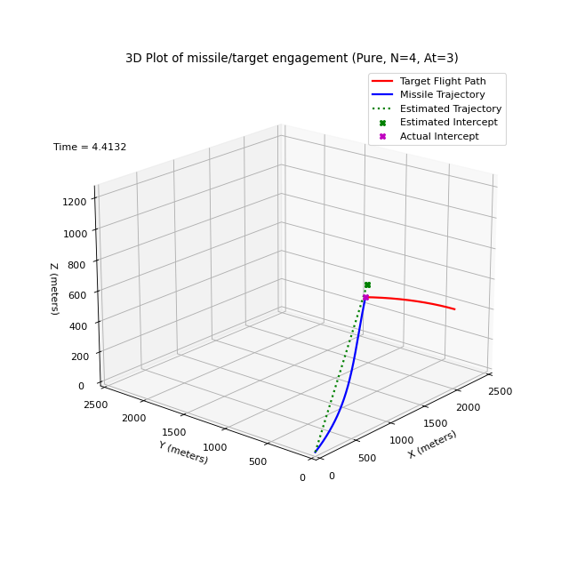

# propNav #

____________

 

   <video width="640" height="480" controls>
    <source src="https://github.com/gedeschaines/gedeschaines.gitgub.io/blob/main/img_anim_1243.mp4" type="video/mp4"/>
   Your browser does not support the video tag. An animated GIF is provided 
   <a href="./img/img_anim_1243.gif" target="_blank">here</a>. 
   </video>
  MP4 video from threeD rendering for TXYZ.OUT.1243.
 

A 3-DOF point mass kinematic model of an ideal proportional navigation guidance missile written entirely in Python 3; dependent upon only two readily available modules - Numpy and Matplotlib.

## Overview ##

The **propNav** program was refactored from a Mathcad variant developed in the mid to late 1990's as a tool to perform rudimentary evaluations of surface to air missile (SAM) enagement capabilities against likely targets. During that time, a high fidelity 6-DOF missile simulation was utilized to perform detailed engineering analysis of candidate SAM performance in specific target engagement scenarios. However, when evaluating performance envelopes for multiple engagement scenarios requiring hundreds of run cases, a 3-DOF was easier to setup, and used much less computing resources and time than the 6-DOF. Of course, there was a known and acceptable loss of accuracy when employing a 3-DOF in this manner.

## Repository Structure ##

The repository main directory contains this README file, plain text disclaimer file, and following Python script files which comprise the **propNav** program.

+ **propNav.py** - Python script for 3-DOF model
+ **RK4_solver.py** - Python script for Runge-Kutta 4th order ODE solver class

The contents of each subdirectory are as follows:

+ ./img - Figure 12 3D plot from **propNav**  SAM case 1234, animated GIF and MP4 video files created with **threeD** from ./out/TXYZ.OUT.1234 file.
+ ./out - TXYZ.OUT trajectory data files written by **propNav** for sample missile/target engagement cases (see "Sample Cases" section below).

## Execution Prerequisites ##

Latest development effort for the **propNav** program has been with Anaconda 3 Python versions 3.7.4 and 3.9.18 on a Windows 10 Pro system using the following Conda packages.

 
Versions of requisite modules associated with Python version
  <table rows="6" cols="3">
   <tr>
    <th colspan="1"> </th>
    <th colspan="2" align="center">Python Version</th>
   </tr>
   <tr>
    <th colspan="1" align="left">Modules</th>
    <th colspan="1" align="center">3.7.4</th>
    <th colspan="1" align="center">3.9.18</th>
   </tr>
   <tr>
    <td align="left">Numpy</td>
    <td align="center">1.16.5</td>
    <td align="center">1.24.4</td>
   </tr>
   <tr>
    <td align="left">Matplotlib</td>
    <td align="center">3.1.1</td>
    <td align="center">3.8.0</td>
   </tr>
  </table>
 

## Execution Overview ##

If utilizing **propNav** from a command terminal, then from within the ./propNav directory, invoke **python propNav.py** to execute propNav.py.

If the "PLOT_DATA" flag in the propNav.py file is set to true, then upon completion of the missile flyout, twelve plot figures will be cascaded across the desktop.

The first figure is a plot depicting closing distances at time-of-intercept and for three time steps immediately preceding time-of-intercept. The last figure is a 3D plot of missile/target engagement as illustrated in the image below. This desktop displayed plot is interactive and can be rotated to different viewing angles.

 

   
  Figure 12 for engagement saved in TXYZ.OUT.1243
 

If the "PRINT_TXYZ" flag in the propNav.py file is set to true, then a trajectory data file of the name "TXYZ.OUT.####" will be written to the ./out subdirectory. This trajectory data file can be read and rendered by the **[threeD](https://github.com/gedeschaines/threeD)** program. Follow steps delineated in the "Execution Overview" section of the associated [README](https://github.com/gedeschaines/threeD#readme) file. The MP4 video displayed in the header of this document was rendered by **threeD**..

Although **propNav** can be run from a command terminal, users may find it easier from within the Spyder IDE application. Doing so allows code modification prior to program execution, such as changing missile or target initial conditions, or selecting different processing options. Additionally, if a Spyder IDE version 4 or greater is utilized, the twelve plot figures can be "inlined" within the Spyder workspace Plot Pane instead of cascaded across the desktop. Unfortunately "inlined" plots are not interactive. This primarily affects the 3D plot presented in figure 12. Instead of being able to rotate the plot for best viewing angle, the "elev" and "azim" arguments in figure 12's "ax.view_init()" procedure call have to be modified and the program rerun.

## Sample Cases ##

The **propNav** program contains hard coded engagement scenarios based on two generic missle types -- surface-to-air (SAM) and air-to-air (AAM). Selecting SAM type engagement scenario enables reproducing the four cases described in the **threeD** program's README  "Caveats" section and embodied in corresponding ./txyz/TXYZ.OUT.100# trajectory files. Selecting AAM type engagement scenario enables reproducing the proportional navigation examples presented in Ben Dickinson's YouTube "Missile Guidance Fundamentals Tutorial" playlist videos for Section 3, Module [3](https://youtu.be/8Dsmh5hLtrE?si=qfXe_PvgNY6vAW7n), Section 3, Module [4](https://youtu.be/Wqakjv92Ygg?si=sIPprhyMh0joiIrS), Section 4, Module [4](https://youtu.be/2SnVShN0Mwo?si=2_lz1s-ItMSNc-qg), and his "Guidance from Optimal Control" playlist video for Section 2, Module [3](https://youtu.be/bEkiwiEUBLM?si=mpOlICOlyoiX07ny).

The provided TXYZ.OUT.124# trajectory files generated by this Python 3-DOF kinematic model of an ideal (no control lag with 100% effective, but bounded commanded acceleration and perfect command response) pure proportional navigation (N=4) guidance missile correspond to the following engagement scenarios for a typical MANPADS type SAM.

+ 1240 - Fixed-wing target at constant speed, altitude and heading.
+ 1241 - Fixed-wing target performing constant 1g banking level turn toward its left.
+ 1242 - Fixed-wing target performing constant 2g banking level turn toward its left.
+ 1243 - Fixed-wing target performing constant 3g banking level turn toward its left.

In each case the SAM, with constant velocity of 450 meters/second, was launched at 12 degree elevation and 10 degree lead azimuth against the target flying at 200 meters/second, initially located at 2000 meters downrange, 500 meters height above ground level, and heading 90 degrees left of the missile launch location.

## References ##

Although references [3] through [5] were not consulted during development of the original Mathcad 3-DOF kinematic ideal pure proportional navigation missile model from which this Python program was derived, they were beneficial for implementation of "True", "ZEM" and "Augmented" proportional navigation formulations, and as validation sources. Reference [6] was consulted to verify original Mathcad expressions for inertial line of sight rotation rate calculations, reformulations to use standard guidance definition for "closing velocity" as "-dRlos/dt", and incorporation of Augmented True and Pure proportional navigation guidance laws.

\[1] Paul Zarchan and A. Richard Seebass (Editor-in-Chief), "Tactical and Strategic Missile Guidance (Progress in Astronautics and Aeronautics, Vol 124)", American Institute of Aeronautics and Astronautics, Washington, D.C.,1990.

\[2] Donald T. Greenwood, "Principles of Dynamics", Prentice-Hall, Inc. of Englewood Clifts, New Jersey, 1965.

\[3] Neil F. Palumbo, Ross A. Blauwkamp, and Justin M. Lloyd, "Basic Principles of Homing Guidance", rev 2018, Johns Hopkins APL Technical Digest, VOL 29, No 1, 2010. [Web available at secwww.jhuapl.edu/techdigest/](https://secwww.jhuapl.edu/techdigest/Content/techdigest/pdf/V29-N01/29-01-Palumbo_Principles_Rev2018.pdf)

\[4] Ben Dickinson, "Missile Guidance Fundamentals Tutorial", last updated Oct. 15, 2023. [Web available at www.youtube.com](https://www.youtube.com/playlist?list=PLcmbTy9X3gXt02z1wNy4KF5ui0tKxdQm7)

\[5] Ben Dickinson, "Guidance from Optimal Control", last updated Apr. 2, 2023. [Web available at www.youtube.com](https://www.youtube.com/playlist?list=PLcmbTy9X3gXsh-o1W60E7rEA35igNj__q)

\[6] Farham A. Faruqi, "Integrated Navigation, Guidance, and Control of Missile Systems: 3-D Dynamic Model", Weapon Systems Division DSTO, DSTO-TR-2805, Feb., 2013. [Web available at www.dst.defence.gov.au](https://www.dst.defence.gov.au/publication/integrated-navigation-guidance-and-control-missile-systems-3-d-dynamic-model)

## Disclaimers ##

+ See the file [DISCLAIMER](./DISCLAIMER)

## Epilogue ##

There are numerous YouTube videos presenting 3-DOF kinematic and 6-DOF dynamic missile models with implementations of simplified to complete proportional navigation guidance control loops. In most cases the models are built using MATLAB and Simulink, which tends to hide technical details within layers of widget abstraction. The purpose of this rudimentary Python model is to provide readily accessable code incorporating fundamental simulation features  without depending on black box routines hiding implementation details. The proportional navigation formulations based on engagment kinematics,  and integration of equations of motion state variable derivates are obvious, even to the most casual observer.
